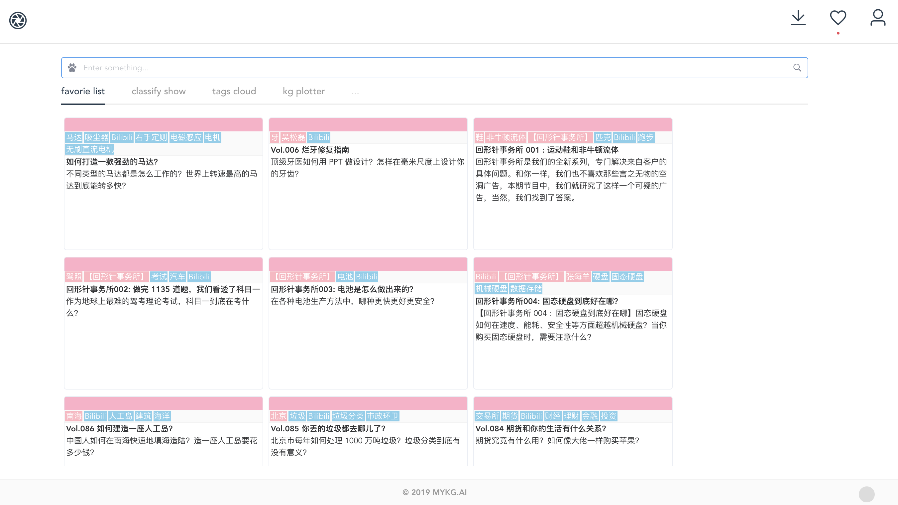
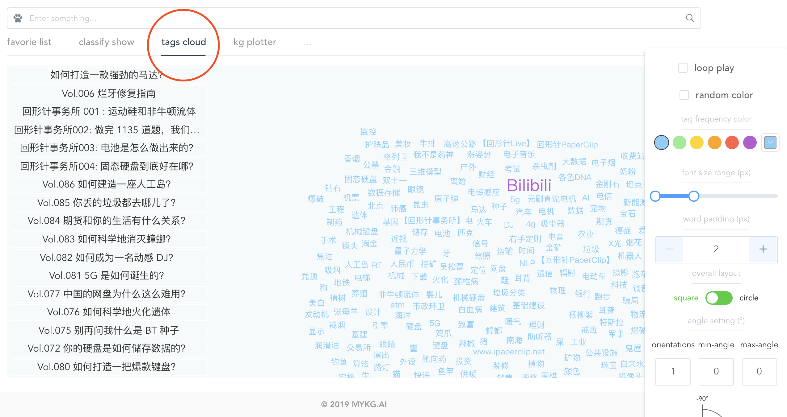
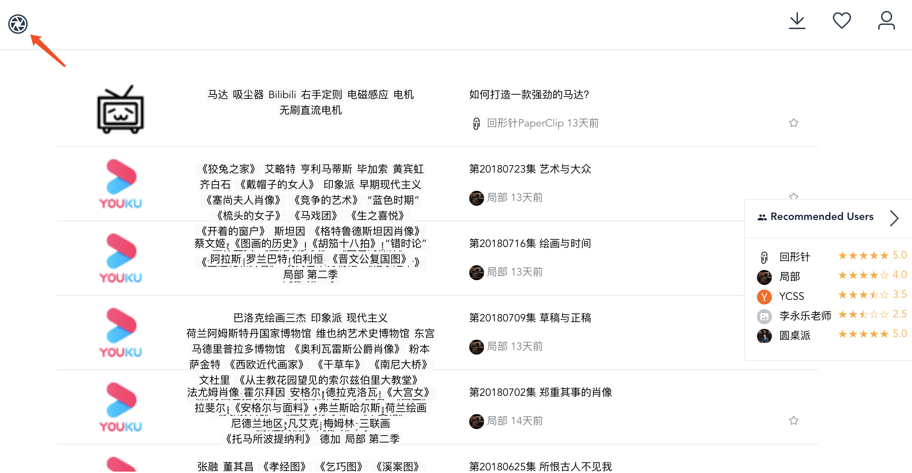
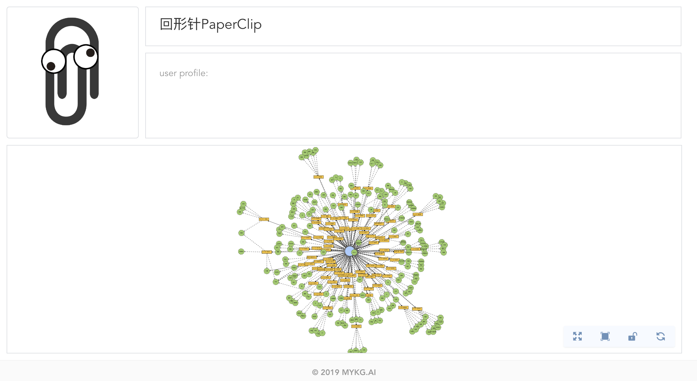

## 👩‍🏫Intro 介绍

面向个人的知识图谱生成工具。整理信息流，记住记不住。

## ⏬Install 使用

1. [Github Release](https://github.com/mykg-ai/chromit/releases)
2. [官网](https://chromit.mykg.ai)安装包下载
3. Chrome应用商店下载

（*1&2 请打开chrome:extensions 使用开发者模式加载）

## 🔧Usage 使用

1. Install the extension as provided above, finish registration on our website. 安装插件，并在[官网 Chromit.mykg.ai](https://chromit.mykg.ai) 上完成账户注册；
2. Trigger the save funtion by clicking the extension icon any time you want. 在浏览网页过程中点击插件按钮随时进行保存；
3. (Keywords and related web info will be extracted/parsed automatically backend. 关键词和重要网页信息会在后台自动完成抽取)
4. Go to [Chromit.mykg.ai](https://chormit.mykg.ai) to check your saves by searching keywords or simply type `space + return` to see all saves.

## 🌟Features 功能

### KG PLOTTER 知识图谱

### TAGS CLOUD 词云

### SQUARE 广场

### Public Profile 个人公开页

## ⚠️Notice 使用注意

- 在墙外使用保存慢&失败率大
- 英文支持不好
- 只有Chrome插件，Safari/Firefox/etc.都没做

## ⌚️Todo & Plan 待办和计划 

- 抽取优化
- Classification 分类功能

## 📢Declaration 声明

北京猫牙科技有限公司(mykg.ai) 版权所有
